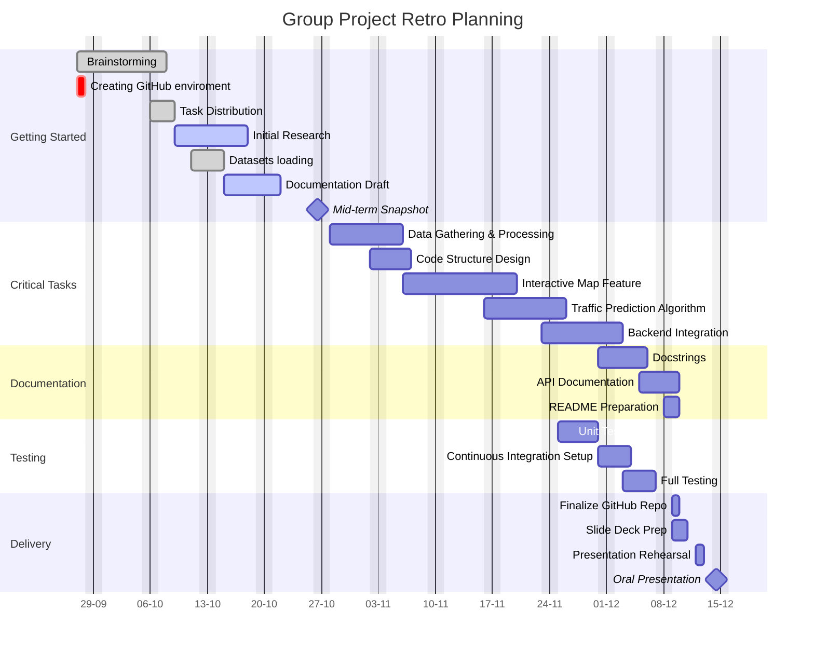
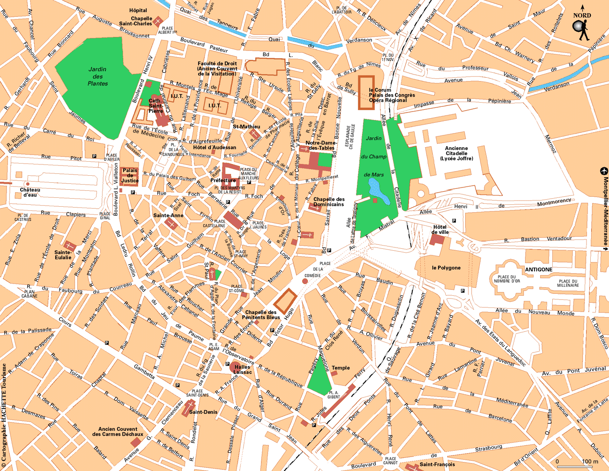

# PROJ_HAX712X: Bikes and Bike-Sharing in Montpellier

## Project Name
**CycleVision3**

## Project Overview
This project aims to analyze bike traffic in Montpellier, focusing on the investigation of bike-sharing rides and cyclist/pedestrian counts. We will leverage various datasets to visualize and predict bike traffic patterns, creating an interactive website to showcase our findings.

## Objectives
- Analyze bike traffic through various datasets, including:
  - **VéloMagg**: Bike-sharing rides from Montpellier Méditerranée Métropole.
  - **Cyclist and Pedestrian Counting**: Data from bike and pedestrian counters.
  - **Open Street Map Data**: Geographic data for visualization.

- Create interactive visualizations, including:
  - An interactive traffic map predicting the next day's bike traffic.
  - Visual representations of bike traffic over different time periods (last month, last year, all years).

## Team Members

We are a group of four working collaboratively on this project. Here is the list of our team members:

1. **ARMAND Charlotte** - Graph, Map, (Vidéo)
2. **CONDAMY Fabian** - Site WEB
3. **SCAIA Matteo** - Map, Graphs, (Vidéo)
4. **STETSUN Kateryna** - Testing, Documentation

## Gantt diagram


## Results Visualization
*image would be different*


## Project Structure
PROJ_HAX712X/
│
├── my_module_name/             # Main code directory
│   ├── __init__.py             # Module initializer
│   ├── main.py                  # Main script
│   └── ...                      # Other Python modules
│
├── slides/                      # Directory for presentation slides
│   ├── presentation.qmd         # Quarto presentation
│
├── roadmap/                     # Directory for project planning
│   ├── README.qmd               # Project outline and planning details
│
├── .gitignore                   # Git ignore file
├── README.md                    # Project README
└── requirements.txt             # Python dependencies

## Datasets
- **Bike-sharing rides**: [https://data.montpellier3m.fr/dataset/courses-des-velos-velomagg-de-montpellier-mediterranee-metropole]
- **Cyclist and pedestrian counting**: [https://data.montpellier3m.fr/dataset/comptages-velo-et-pieton-issus-des-compteurs-de-velo]
- **Open Street Map**: [https://www.openstreetmap.org/]

## Technologies Used
- **Programming Language**: Python
- **Frameworks/Libraries**:
  - **Pandas**: For data manipulation and analysis.
  - **Matplotlib**: For creating static, animated, and interactive visualizations.
  - **Folium**: For visualizing data on interactive maps.
  - **Sphinx**: For generating documentation.
  - **Quarto**: For creating a website to showcase project results.
- **Documentation**: Sphinx/Quarto for documentation and website generation.

## Coding Pipeline
The coding pipeline for this project involves the following steps:
1. **Data Acquisition**: 
   - Collect datasets from various sources, including bike-sharing rides, cyclist and pedestrian counting data, and Open Street Map.
2. **Data Cleaning and Preprocessing**: 
   - Use **Pandas** for cleaning and preparing the datasets for analysis.
3. **Data Analysis and Visualization**: 
   - Implement analysis using **Pandas** and generate visualizations with **Matplotlib** and **Folium**.
4. **Interactive Features**:
   - Develop an interactive map feature for predicting bike traffic patterns.
5. **Documentation**:
   - Maintain comprehensive documentation using **Sphinx** and **Quarto** to ensure clarity and usability for users.
6. **Version Control**: 
   - Use **Git** for version control, ensuring that all code changes are tracked and collaboration among team members is facilitated.
7. **Continuous Integration**:
   - Implement CI practices to run tests automatically on each commit to ensure code quality and reliability.

## Ignored Files
To maintain a clean project structure and avoid committing unnecessary files, the following files and directories are ignored in the version control:
- **Compiled Files**:
  - Byte-compiled files such as `__pycache__/`, `*.py[cod]`, and `*$py.class`.
- **C Extensions**:
  - Files with the extension `*.so`.
- **Distribution and Packaging**:
  - Ignore build artifacts, including `build/`, `dist/`, and various egg-info files.
- **Testing Artifacts**:
  - Directories and files related to testing, such as `htmlcov/`, `.tox/`, `.coverage`, and others.
- **Environment Settings**:
  - Local environment variables and settings files such as `.env`, `venv/`, and any backup directories.
- **Documentation Builds**:
  - Ignore outputs generated during documentation builds, including `docs/_build/` and `/site`.
- **IDE and Project Specific Files**:
  - Ignore project-specific configurations from IDEs like Spyder, PyCharm, etc. (e.g., `.idea/`, `.spyderproject`).

## Getting Started
1. **Clone the Repository**:
   ```bash
   git clone https://github.com/mscaia/PROJ_HAX712X.git
   cd PROJ_HAX712X
