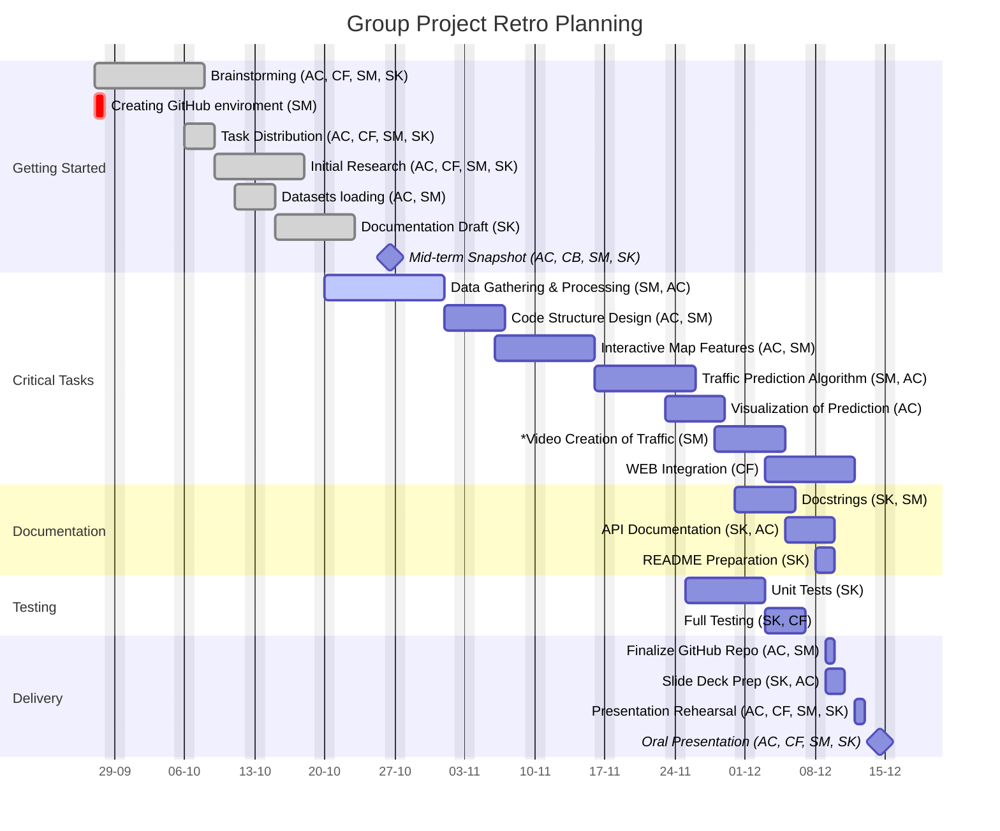
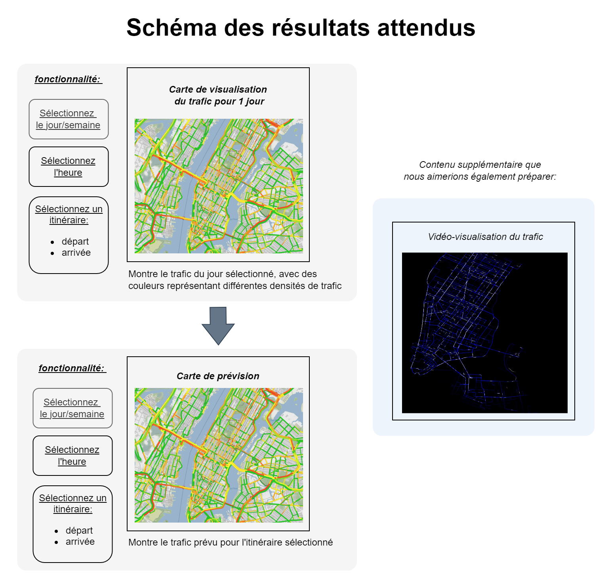

# CycleVision3

## Project Overview
This project aims to analyze bike traffic in Montpellier, focusing on the investigation of bike-sharing rides and cyclist/pedestrian counts. We will leverage various datasets to visualize and predict bike traffic patterns, creating an interactive website to showcase our findings.

## Objectives
- Analyze bike traffic through various datasets, including:
  - **VéloMagg**: Bike-sharing rides from Montpellier Méditerranée Métropole.
  - **Cyclist and Pedestrian Counting**: Data from bike and pedestrian counters.
  - **Open Street Map Data**: Geographic data for visualization.

- Create interactive visualizations, including:
  - Visual representations of bike traffic over different time periods (by day, by month etc).
  - An interactive traffic map predicting the next day's bike traffic.
- Regroup all the different productions in an interactive website.

#### Future Projects:
- *Compare pollution trends*: Analyze how traffic impacts pollution levels and identify correlations between increased traffic and worsening air quality.
- *Construction-aware traffic map*: Develop an interactive map that accounts for ongoing road construction and its effects on traffic.
- *Alternative route suggestions*: Provide less congested route options based on real-time traffic data.

## Team Members

We are a group of four working collaboratively on this project. Here is the list of our team members:

1. **ARMAND Charlotte** - Graphs, Map, (Vidéo)
2. **CONDAMY Fabian** - Website
3. **SCAIA Matteo** - Graphs, Map, (Vidéo)
4. **STETSUN Kateryna** - Testing, Documentation

## Gantt diagram

_For each task, the initials of the responsible team members are provided in parentheses following the task name. The initials correspond to the following members:_  
  - _Armand Charlotte - AC;_  
  - _Condamy Fabian - CF;_
  - _Scaia Matteo - SM;_
  - _Stetsun Kateryna - SK._ 

_In instances where tasks involve multiple individuals but do not include the entire team, the first initials indicate the primary individual responsible for overseeing the task. Tasks with \* are marked as hypothetical._

## Results Visualization


## Project Structure
```
main/                                           # Main project directory
├── Site_Projet/                                # Directory for website files
│   ├── .gitignore                              # Lists files to be ignored by Git
│   ├── _quarto.yml                             # Configuration file for Quarto project settings
│   ├── about.qmd                               # Content for the About page
│   ├── index.qmd                               # Main homepage content
│   └── styles.css                              # CSS file for website styling
├── cache/                                      # Temporary files
├── data/                                       # Data storage of 3 datasets
│   ├── CoursesVelomagg.csv                     # Dataset for bike-sharing rides
│   ├── EcoCompt1.json                          # Dataset for cyclist and pedestrian counts
│   └── GeolocCompteurs.csv                     # Dataset for geolocation data
├── images/                                     # Images used in the project
├── src/                                        # Source code directory
│   ├── __init__.py                             # Initializes the package
│   ├── donnée.py                               # Contains data-related functions
│   └── fonctions_basedonnees.py                # Functions for database operations
├── visualisation/                              # Visualization outputs
│   ├── visu.py                                 # Visualization script
├── .Rhistory                                   # R history file
├── .gitignore                                  # Git ignore file
├── README.md                                   # Main project documentation file
├── carte.py                                    # Script for generating maps
├── carte_montpellier_trajet.html               # HTML map output
├── carte_montpellier_trajet_via_BD.html        # HTML map with database route
├── map.py                                      # Main mapping script
├── map_trajet_BD.py                            # Script for journey mapping
├── montpellier_bike_stations_map.html          # Map of bike stations
├── output.png                                  # Output image file
└── requirements.txt                            # Project dependencies
```

## Datasets
- **Bike-sharing rides**: [https://data.montpellier3m.fr/dataset/courses-des-velos-velomagg-de-montpellier-mediterranee-metropole]
- **Cyclist and pedestrian counting**: [https://data.montpellier3m.fr/dataset/comptages-velo-et-pieton-issus-des-compteurs-de-velo]
- **Open Street Map**: [https://www.openstreetmap.org/]

## Technologies Used
- **Programming Language**: Python
- **Frameworks/Libraries**:
  - **Pandas**: For data manipulation and analysis.
  - **Matplotlib**: For creating static, animated, and interactive visualizations.
  - **Folium**: For visualizing data on interactive maps.
  - **Sphinx**: For generating documentation.
  - **Quarto**: For creating a website to showcase project results and slides.
- **Documentation**: Sphinx/Quarto for documentation and website generation.

## Coding Pipeline
The coding pipeline for this project involves the following steps:
1. **Data Acquisition**: 
   - Collect datasets from various sources, including bike-sharing rides, cyclist and pedestrian counting data, and Open Street Map.
2. **Data Cleaning and Preprocessing**: 
   - Use **Pandas** for cleaning and preparing the datasets for analysis.
3. **Data Analysis and Visualization**: 
   - Implement analysis using **Pandas** and generate visualizations with **Matplotlib** and **Folium**.
4. **Interactive Features**:
   - Develop an interactive map feature for predicting bike traffic patterns.
5. **Documentation**:
   - Maintain comprehensive documentation using **Sphinx** and **Quarto** to ensure clarity and usability for users.
6. **Version Control**: 
   - Use **Git** for version control, ensuring that all code changes are tracked and collaboration among team members is facilitated.

## Ignored Files
To maintain a clean project structure and avoid committing unnecessary files, the following files and directories are ignored in the version control:
- **Compiled Files**:
  - Byte-compiled files such as `__pycache__/`, `*.py[cod]`, and `*$py.class`.
- **C Extensions**:
  - Files with the extension `*.so`.
- **Distribution and Packaging**:
  - Ignore build artifacts, including `build/`, `dist/`, and various egg-info files.
- **Testing Artifacts**:
  - Directories and files related to testing, such as `htmlcov/`, `.tox/`, `.coverage`, and others.
- **Environment Settings**:
  - Local environment variables and settings files such as `.env`, `venv/`, and any backup directories.
- **Documentation Builds**:
  - Ignore outputs generated during documentation builds, including `docs/_build/` and `/site`.
- **IDE and Project Specific Files**:
  - Ignore project-specific configurations from IDEs like Spyder, PyCharm, etc. (e.g., `.idea/`, `.spyderproject`).

## Getting Started
1. **Clone the Repository**:
   ```bash
   git clone https://github.com/mscaia/PROJ_HAX712X.git
   cd PROJ_HAX712X
