---

::: {.hidden}
{{

\DeclareMathOperator*{\argmax}{arg\,max}
\newcommand{\1}{{1\hspace{-3.8pt} 1}}

}}
:::


<!---------------------------------------------------------------------------->

#### {#title-slide data-menu-title="Title Slide" style="text-align: center;"}
<br>


<br>
<div style="text-align: center;">
<br>
<br>
[CycleVision3]{.custom-title .center}
<br>
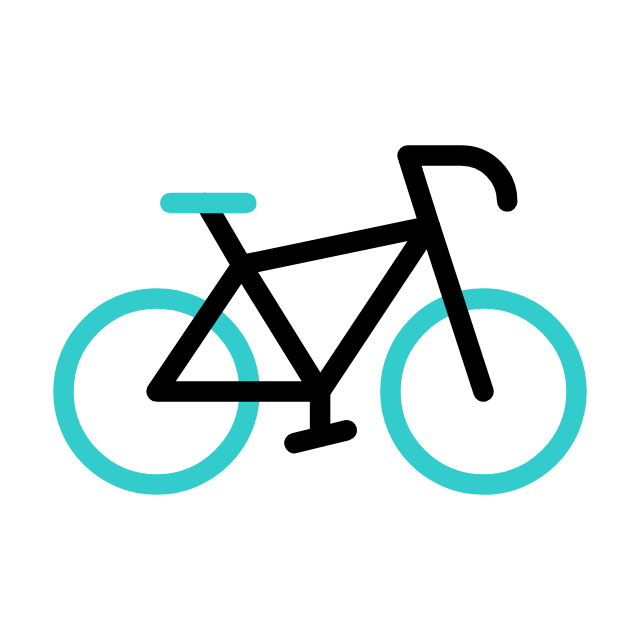{width=21%}
<br>
[Armand Charlotte, Condamy Fabian, Scaia Matteo, Stetsun Kateryna]{.custom-subtitle3}
</div>

<!---------------------------------------------------------------------------->
<!---------------------------------------------------------------------------->
##
<div style="text-align: center;">
[🚴‍♂️ **Vous êtes-vous déjà demandé...**]{.custom-subtitle33 .center}
<br> 
</div>
::: fragment
>*... comment arriver à l'université à temps pour votre examen important lorsque vous êtes coincé dans un trafic de vélos à l'heure de pointe ?*
<div style="text-align: center;">
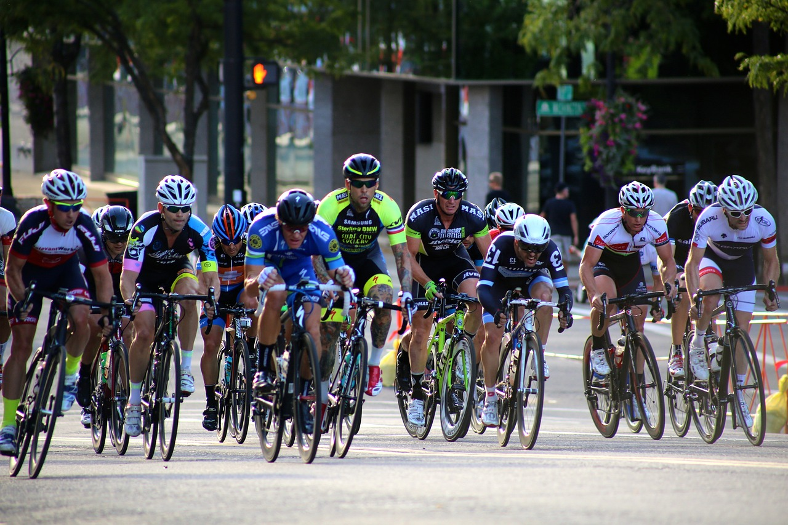{ width=80% }
</div>
:::
<!---------------------------------------------------------------------------->
<!---------------------------------------------------------------------------->
## Notre Mission
<hr>
::: {.incremental} 
- **Nous analysons :**  
  - Les flux de vélos en temps réel dans la ville de Montpellier.  
  - Les mouvements de cyclistes pour prévoir les situations de congestion.  
  - Des solutions pratiques pour optimiser vos trajets dans les embouteillages.  
- **Objectifs :**  
  - Visualiser et analyser les flux cyclistes.  
  - Prévoir les mouvements de trafic avec une carte interactive.  
  - Proposer des solutions pour optimiser les infrastructures urbaines.
:::

::: fragment
L’ambition du projet est de développer des **visualisations interactives**, notamment une **carte prédictive des flux cyclistes**, accessibles via un site web dédié.  
:::
::: fragment
- Identifier les tendances de mobilité pour mieux comprendre les habitudes des usagers.  
- Proposer des solutions pratiques afin d’optimiser les infrastructures urbaines et de promouvoir l’usage du vélo comme moyen de transport durable.
:::
<!---------------------------------------------------------------------------->
<!---------------------------------------------------------------------------->
# Introduction et organisation {.section-background}
<!---------------------------------------------------------------------------->

<!---------------------------------------------------------------------------->
## Présentation du projet
<hr>
::: fragment
<div style="text-align: left;">
Le projet **CycleVision3** a pour objectif d’analyser et de prédire les flux cyclistes dans la ville de Montpellier à l’aide de données issues de trois sources principales :  
</div> 
:::

::: {.incremental} 
- **VéloMagg** : Historique des trajets en vélos en libre-service.  
- **Capteurs cyclistes/piétons** : Données collectées aux points clés de la ville.  
- **OpenStreetMap (OSM)** : Données géographiques pour la cartographie.
:::

::: fragment
<div style="text-align: center;">
[**Schéma des résultats attendus :**]{.custom-subtitle3}
{width=150%}
</div>
:::
<!---------------------------------------------------------------------------->
<!---------------------------------------------------------------------------->
## Contribution de l'équipe
<hr>
::: {.columns}
::: {.column width="9%"}
<div style="text-align: center;">
{width=60%}
</div>
:::
::: {.column width="90%"}
- **ARMAND Charlotte** : Création de cartes interactives et prévisions de trafic.
:::
:::

::: fragment
::: {.columns}
::: {.column width="9%"}
<div style="text-align: center;">

</div>
:::
::: {.column width="90%"}
- **CONDAMY Fabian** : Développement et déploiement du site web.
:::
:::
:::

::: fragment
::: {.columns}
::: {.column width="9%"}
<div style="text-align: center;">
{width=60%}
</div>
:::
::: {.column width="90%"}
- **SCAIA Matteo** : Analyse de données et création de cartes interactives et vidéos.
:::
:::
:::

::: fragment
::: {.columns}
::: {.column width="9%"}
<div style="text-align: center;">

</div>
:::
::: {.column width="90%"}
- **STETSUN Kateryna** : Documentation du projet et assistance développement du site web.
:::
:::
:::

::: fragment
<div class="message1">
<br>
<br>
*Note importante : Bien que les tâches principales soient spécifiées pour chaque membre, tous les participants ont collaboré de manière active et apporté leur soutien mutuel dans la résolution des défis rencontrés tout au long du projet.*
</div>
:::
<!---------------------------------------------------------------------------->
<!---------------------------------------------------------------------------->
## Structure du projet
<hr>

<div class="message1" style="text-align: center;">
<pre>
PROJ_HAX712X/                                   # Répertoire principal du projet
├── .github/workflows/                          # Configuration pour l'intégration continue
├── cache/                                      # Fichiers temporaires
├── Cycle3                                      #
│   ├── analyse_donnee/                         # Scripts pour l'analyse des données
│   ├── docs/                                   #
│   ├── images/                                 # Images utilisées dans le projet
│   ├── map/                                    # Scripts pour les cartes interactives
│   ├── video/                                  # 
│   ├── visualisation/                          # Résultats des visualisations
│   ├── data/                                   # Données des 3 jeux de données
├── docs/                                       # Répertoire des fichiers du site web
├── roadmap/                                    # Fichier README.md avec la description .......
├── slide/                                      # 
├── src/                                        # Répertoire contenant le code source
├── .DS_Store                                   # 
├── .Rhistory                                   # Fichier d'historique R
├── .gitignore                                  # Fichier Git ignore
├── README.md                                   # Documentation principale du projet
└── requirements.txt                            # Dépendances du projet
</pre>
</div>
<!---------------------------------------------------------------------------->
<!---------------------------------------------------------------------------->
# Résultats obtenus {.section-background}
<!---------------------------------------------------------------------------->
<!---------------------------------------------------------------------------->
## Analyse des datasets
<hr>

::: fragment
<div style="text-align: center;">
[**Nombre total de trajets des différentes années depuis 2020**]{.custom-subtitle3}
</div>
::: {.columns style="display: flex; justify-content: center;"}
::: {.column width="25%"}
<div style="text-align: center;">
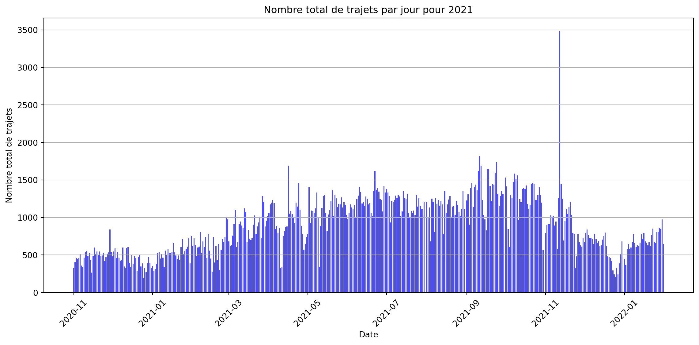
</div>
:::
::: {.column width="25%"}
<div style="text-align: center;">
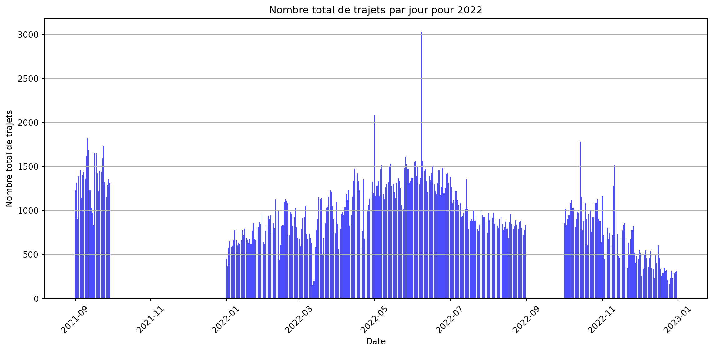
</div>
:::
::: {.column width="25%"}
<div style="text-align: center;">
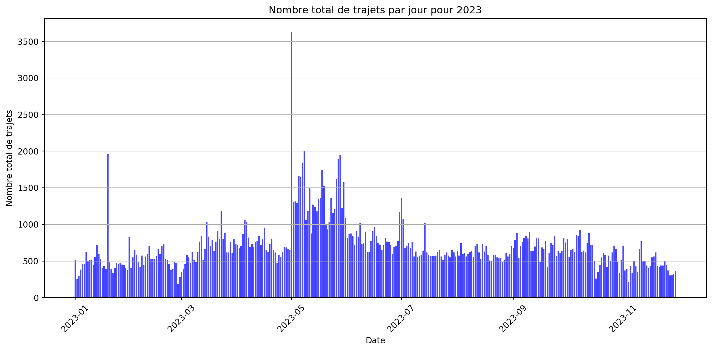
</div>
:::
::: {.column width="25%"}
<div style="text-align: center;">
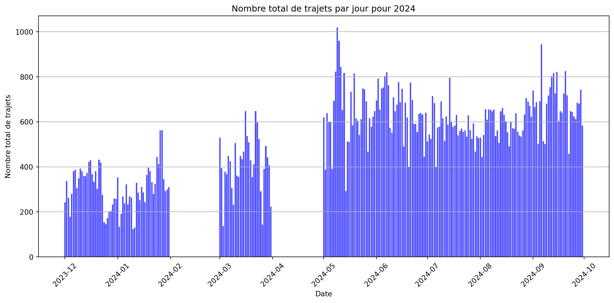
</div>
:::
:::
:::

::: fragment
<div style="text-align: center;">
[**Distance moyenne parcourue et stations les plus populaires**]{.custom-subtitle3}
</div>
::: {.columns style="display: flex; justify-content: center;"}
::: {.column width="45%"}
<div style="text-align: center;">
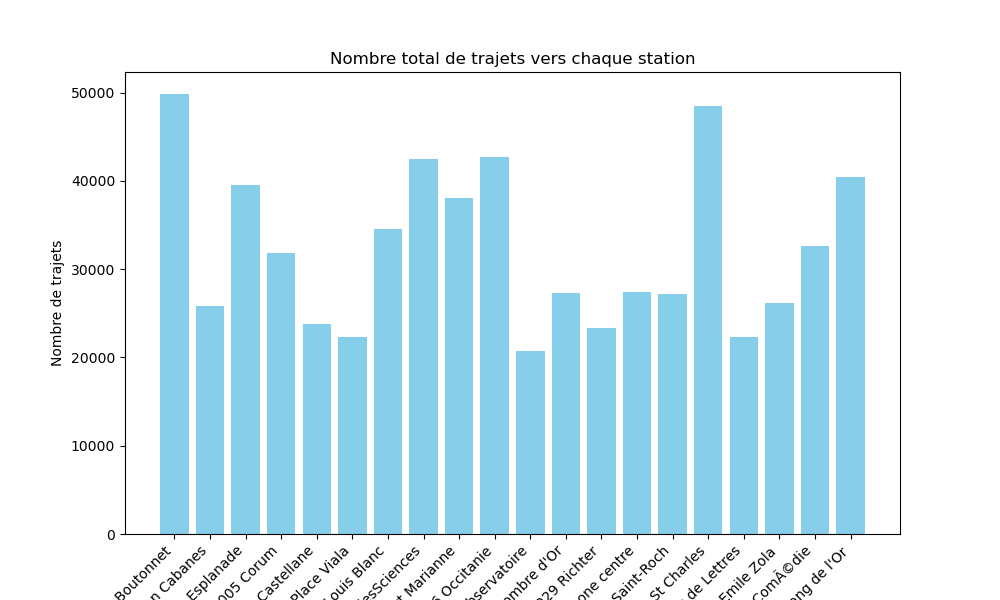
</div>
:::
::: {.column width="45%"}
<div style="text-align: center;">
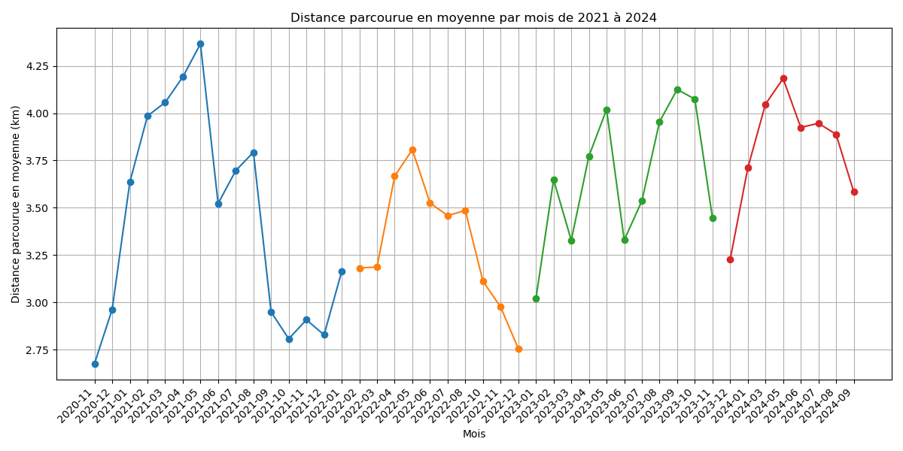
</div>
:::
:::
:::

<!---------------------------------------------------------------------------->
<!---------------------------------------------------------------------------->
## Creation maps interactives
<hr>
<div style="text-align: center;">
[**Stations de vélos à Montpellier**]{.custom-subtitle3}
</div>

<div style="text-align: center;">
```{python}
import osmnx as ox
import folium
import requests
from IPython.display import IFrame

# Définir l'endroit
ville = "Montpellier, France"

# Récupérer le polygone des limites de Montpellier
frontiere = ox.geocode_to_gdf(ville)

# Obtenir les coordonnées du centre de Montpellier
location = ox.geocode(ville)

# Créer une carte Folium
m = folium.Map(location=location, zoom_start=14)

# Extraire les coordonnées des limites de la ville
coords = frontiere.geometry.values[0].exterior.coords[:]
folium.Polygon(
    locations=[(lat, lon) for lon, lat in coords],
    color='black',
    fill=False,
    weight=2.5,
).add_to(m)

# URL de l'API
url = "https://portail-api-data.montpellier3m.fr/bikestation?limit=1000"
fichier = requests.get(url, headers={"accept": "application/json"})

# Ajouter des marqueurs
if fichier.status_code == 200:
    data = fichier.json()
    for station in data:
        address = station['address']['value']['streetAddress']
        velo_present = station['availableBikeNumber']['value']
        total_place = station['freeSlotNumber']['value']
        rapport = (velo_present / total_place) * 100 if total_place > 0 else 0
        popup_text = f"""
        <div style="font-size: 14px; font-weight: bold; color: black;">
            <p><b>Station:</b> {address}</p>
            <p><b>Vélos disponibles:</b> {velo_present}</p>
            <p><b>Vélos total:</b> {total_place}</p>
            <p><b>Pourcentage de vélos disponibles:</b> {rapport:.2f}%</p>
        </div>
        """
        coords = station['location']['value']['coordinates']
        folium.Marker(
            location=(coords[1], coords[0]),
            popup=folium.Popup(popup_text, max_width=300),
            icon=folium.Icon(color='blue', icon='info-sign')
        ).add_to(m)

m.save("map.html")

# iframe
display(IFrame("map.html", width="100%", height="450px"))
```
</div>

<div class="message">
<br>
<br>
Ci-dessous, vous trouverez une carte interactive présentant le *nombre de vélos en temps réel* disponibles dans les stations de la métropole de Montpellier. Cette carte offre une vue d’ensemble dynamique permettant de suivre l’état des stations en direct.
</div>
<!---------------------------------------------------------------------------->
<!---------------------------------------------------------------------------->
## Visualisation vidéo
<hr>
<div class="slide-content" style="text-align: center;">
  <video width="1000" controls>
    <source src="images/video_present.mp4" type="video/mp4">
    Your browser does not support the video tag.
  </video>
</div>

<!---------------------------------------------------------------------------->
<!---------------------------------------------------------------------------->
## Simulations et prédictions
<hr>

::: {.columns style="display: flex; justify-content: center;"}

::: {.column width="50%"}
<div style="text-align: center;">
[**Carte des intensités**]{.custom-subtitle3}
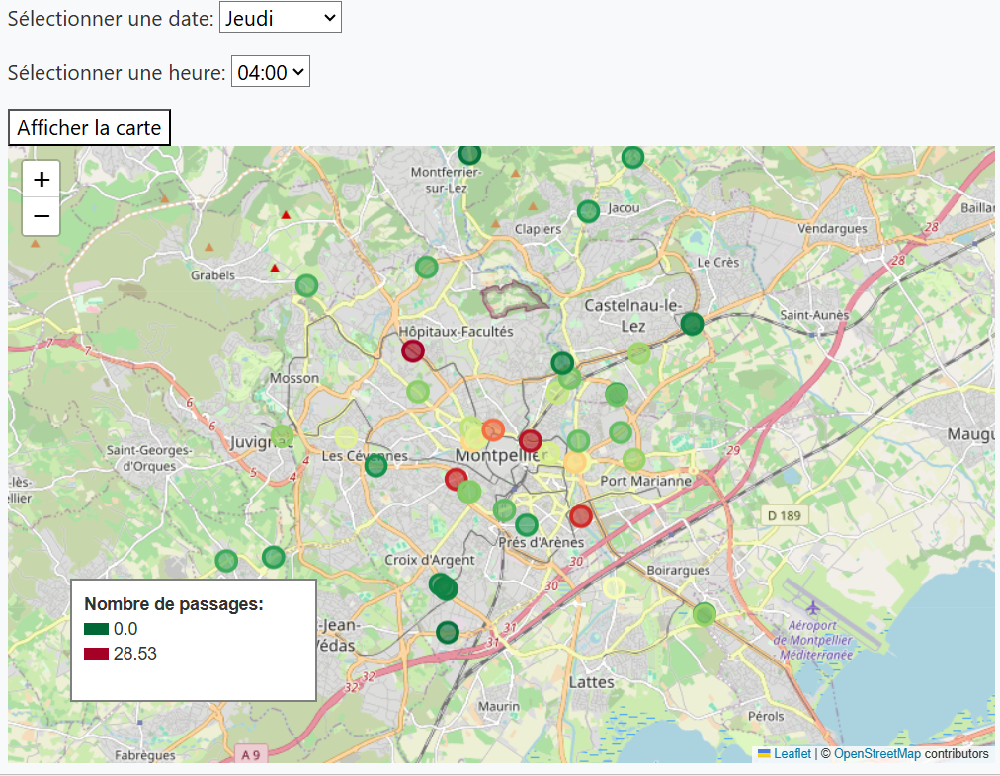
</div>
:::

::: {.column width="50%"}
<div style="text-align: center;">
[**Carte des trajets**]{.custom-subtitle3}
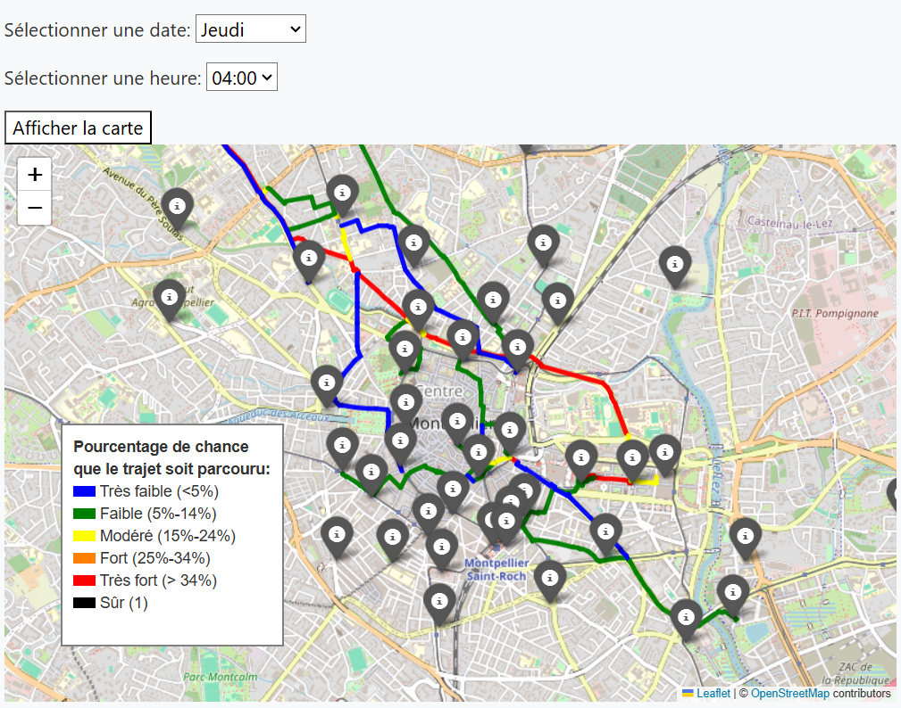
</div>
:::

:::

<!---------------------------------------------------------------------------->
<!---------------------------------------------------------------------------->
## WEB integration
<hr>

VIDEO DE SITE

<!---------------------------------------------------------------------------->
<!---------------------------------------------------------------------------->
## Documentation des projet
<hr>

::: {.incremental} 
1. **Documentation Technique**  
   - Détails des fonctions clés : 
        - cartes interactives (Folium)
        - prédictions avec analyse de données 
        - gestion et analyse vidéo.
   - Documentation complète du class GestionnaireDonnees.  
2. **Guide Utilisateur et ReadMe** : Création d’un guide utilisateur et d’un ReadMe clair facilitant l’installation et l’utilisation.
3. **Workflow et Pipeline de Traitement des Données** : Documentation du Workflow du projet et du Pipeline de traitement avec explications pour chaque étape.
4. **Tests et Performance Analysis** : Documentation des tests pour valider le projet et analyse des performances dans divers scénarios.
5. **Tentative avec Sphinx pour la Documentation** : Mise en place initiale de la documentation avec Sphinx, même si elle n'a pas été finalisée.   
:::

<!---------------------------------------------------------------------------->
<!---------------------------------------------------------------------------->
# Analysation de programm {.section-background}
<!---------------------------------------------------------------------------->
<!---------------------------------------------------------------------------->
## Tests
<hr>

::: {.incremental}  
1. **Validation des dépendances**  : Test automatisé pour garantir l'installation correcte des bibliothèques listées dans `requirements.txt`.
2. **Tests d’intégration des données**  
   - Vérification de la connexion et du bon chargement des fichiers de données (CSV, JSON).
   - Validation du format et de la qualité des données en entrée.
3. **Affichage des cartes interactives** : Tests fonctionnels pour confirmer l’affichage et l’interactivité des cartes générées par Folium.
4. **Automatisation avec GitHub Actions** : Configuration d’un pipeline CI/CD pour exécuter des tests basiques à chaque mise à jour du code.
5. **Tests de connectivité** : Simulation d'accès utilisateur au site web pour vérifier la disponibilité et la navigation entre les sections.  
:::
<!---------------------------------------------------------------------------->
<!---------------------------------------------------------------------------->
## Analyse des performances
<hr>

::: fragment
<div style="text-align: center;">
<br>
<br>
[**Pour map_trajet_BD.py**]{.custom-subtitle3}
</div>
:::

::: fragment
::: {.columns style="display: flex; justify-content: center;"}
::: {.column width="50%"}
<div style="text-align: center;">
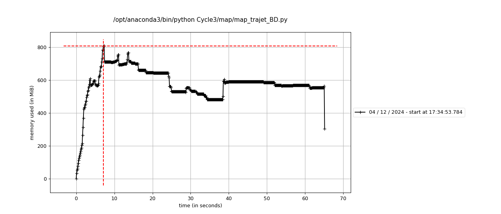
</div>
:::
::: {.column width="50%"}
<div style="text-align: center;">
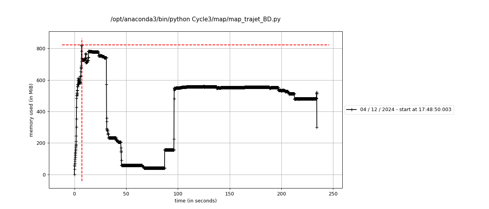
</div>
:::
:::
:::

::: fragment
Les graphiques montrent les performances pour différentes quantités de trajets.
:::
<!---------------------------------------------------------------------------->


<!---------------------------------------------------------------------------->
## Analyse des performances et d'utilisation de la mémoire
<hr>

::: fragment
<div style="text-align: center;">
[**Pour map_trajet_BD.py**]{.custom-subtitle3}
</div>
::: {.columns style="display: flex; justify-content: center;"}
::: {.column width="30%"}
<div style="text-align: center;">

</div>
:::
::: {.column width="30%"}
<div style="text-align: center;">

</div>
:::
:::
:::

::: fragment
<div style="text-align: center;">
[**Pour vidéo.py**]{.custom-subtitle3}
</div>
::: {.columns style="display: flex; justify-content: center;"}
::: {.column width="30%"}
<div style="text-align: center;">
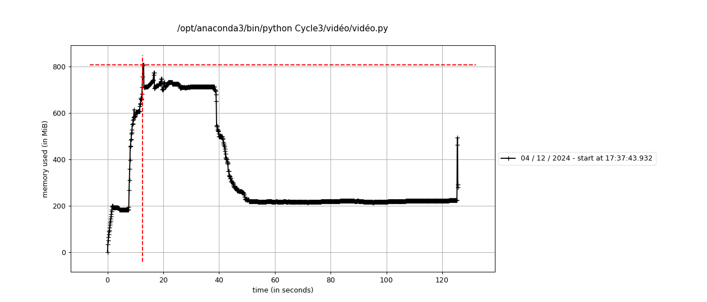
</div>
:::
::: {.column width="30%"}
<div style="text-align: center;">
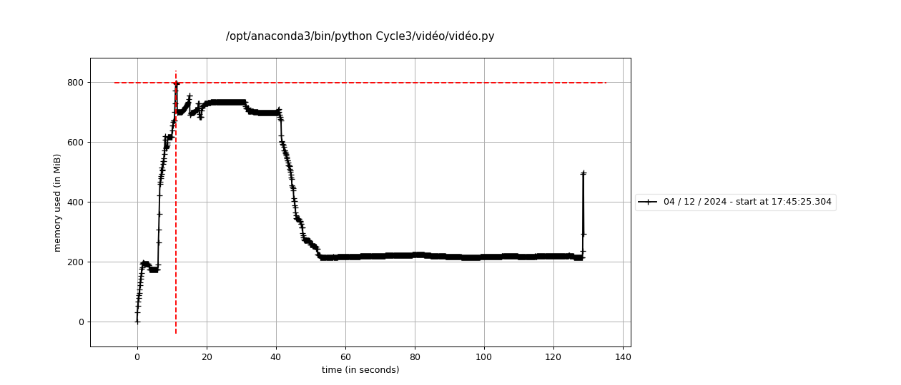
</div>
:::
:::
:::

::: fragment
::: {.columns style="display: flex; justify-content: center;"}
::: {.column width="30%"}
<div style="text-align: center;">
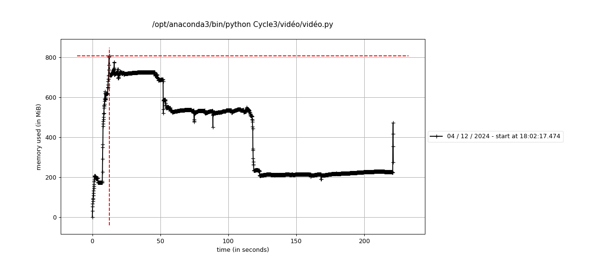
</div>
:::
::: {.column width="30%"}
<div style="text-align: center;">
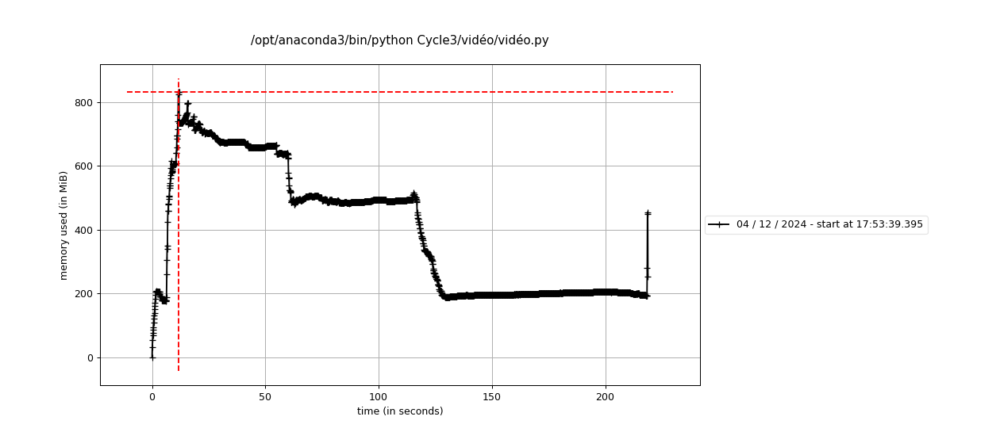
</div>
:::
:::
:::

::: fragment
<div class="message">
<br>
<br>
*Concernant l'efficacité temporelle, plusieurs problèmes ont été rencontrés lors des premiers essais. Pour y remédier, des outils tels que **ThreadPoolExecutor** et l'utilisation de **cache** ont été mis en place. De plus, un choix stratégique a été fait en privilégiant l'importation directe des bases de données, plutôt que de les appeler via des requêtes HTTP avec `requests`, afin d'améliorer la vitesse d'exécution.*
</div>
:::
<!---------------------------------------------------------------------------->
<!---------------------------------------------------------------------------->
# Conclusion {.section-background}
<!---------------------------------------------------------------------------->
<!---------------------------------------------------------------------------->
## Comparaison des diagrammes de Gantt 
<hr>
:::: {.columns}
::: {.column width="48%"}
<div style="text-align: center;">
**Planification initiale du projet**
    ```{mermaid}
    gantt
        dateFormat  YYYY-MM-DD
        axisFormat  %d-%m
        excludes weekends
    section Critical Tasks
        Data Gathering & Processing (SM, AC) : done, 2024-10-20, 10d
        Code Structure Design (AC, SM) : done, 2024-11-01, 4d
        Interactive Map Features (AC, SM) : done, 2024-11-06, 8d
        Traffic Prediction Algorithm (SM, AC) : done, 2024-11-16, 7d
        Visualization of Prediction (AC) : done, 2024-11-23, 5d
        *Video Creation of Traffic (SM) : done, 2024-11-28, 5d
        WEB Integration (CF) : done, 2024-12-03, 7d

    section Documentation
        Docstrings (SK, SM) : done, 2024-11-30, 5d
        API Documentation (SK, AC) : done, 2024-12-05, 3d
        README Preparation (SK) : done, 2024-12-08, 2d

    section Testing
        Unit Tests (SK) : done, 2024-11-25, 6d
        Full Testing (SK, CF) : done, 2024-12-03, 4d

    section Delivery
        Finalize GitHub Repo (AC, SM) : done, 2024-12-09, 1d
        Slide Deck Prep (SK, AC): done, 2024-12-09, 2d
        Presentation Rehearsal (AC, CF, SM, SK): done, 2024-12-12, 1d
        Oral Presentation (AC, CF, SM, SK): milestone, 2024-12-13, 1d
    ```
</div>
:::
::: {.column width="48%"}
<div style="text-align: center;">
**Plan réalisé après exécution**
    ```{mermaid}
    gantt
        dateFormat  YYYY-MM-DD
        axisFormat  %d-%m
        excludes weekends
    section Critical Tasks
        Data Gathering & Processing (SM, AC) : done, 2024-10-20, 10d
        Code Structure Design (AC, SM) : done, 2024-11-01, 4d
        Interactive Map Features (SM, AC) : done, 2024-11-06, 6d
        Traffic Prediction Algorithm (AC, SM) : done, 2024-11-13, 9d
        Visualization of Prediction (AC) : 2024-11-22, 8d
        Video Creation of Traffic (SM) : 2024-11-14, 9d
        WEB Integration (CF) : 2024-10-23, 34d

    section Documentation
        Docstrings at the site (SK) : 2024-11-10, 21d
        API Documentation (SK) : done, 2024-12-05, 3d
        README Preparation (SK) : 2024-11-25, 5d

    section Testing
        Unit Tests (SK) : 2024-11-26, 2d
        Full Testing (SK, SM) : 2024-12-01, 7d
        Performance Analysis (SM) : 2024-12-04, 2d

    section Delivery
        Finalize GitHub Repo (SM, CF) : 2024-12-07, 1d
        Slide Deck Prep (SK): 2024-12-03, 5d
        Presentation Rehearsal (AC, CF, SM, SK): 2024-12-10, 3d
        Oral Presentation (AC, CF, SM, SK): milestone, 2024-12-13, 1d
    ```
</div>
:::
::::
::: fragment
<div class="message">
*Les blocs bleus dans les deux diagrammes représentent les tâches qui ont subi des changements, ajustements ou délais supplémentaires pendant la réalisation du projet.*
</div>
:::
<!---------------------------------------------------------------------------->
<!---------------------------------------------------------------------------->
## Problèmes rencontrés
<hr>

::: {.incremental}  
1. **Gestion des données :** Problèmes avec les formats des données (json non formatés, csv ou dataframe) et les données manquantes.  
2. **Création de cartes interactives et prévisions de trafic :** Longueur en temps des créations de cartes.  
3. **Déploiement du site web :**  
    - Déploiement du site au tout début (GitHub Pages).  
    - Intégration des cartes, surtout celle avec l'application Shiny.
4. **Documentation du projet :**  
    - Le grand nombre de fonctions a rendu leur formatage clair et lisible complexe.  
    - La configuration et la personnalisation des fichiers pour garantir un rendu cohérent (pour le **Sphinx**).
5. ** :**  
     - [Ajouter les difficultés rencontrées par les membres de l'équipe ici]  

:::
<!---------------------------------------------------------------------------->
<!---------------------------------------------------------------------------->
## Améliorations futures
<hr>

::: {.incremental}

- **Renforcement des modèles de prédiction** : Une amélioration des modèles actuels pourrait être réalisée en intégrant des données supplémentaires, comme les conditions météorologiques ou les événements locaux, afin d'obtenir des prévisions plus précises.
- **Ajout de données en temps réel** : L'intégration de données en temps réel, telles que les flux de trafic ou les perturbations temporaires, pourrait rendre les analyses plus dynamiques et adaptées à l'évolution des conditions.
- **Application à d'autres contextes urbains** : Étendre cette méthodologie à d'autres villes permettrait de comparer les tendances cyclistes et d'identifier des spécificités locales ou des modèles universels.
- **Amélioration de l'expérience utilisateur** : Le site Web pourrait être enrichi de fonctionnalités interactives supplémentaires, telles que la visualisation des prévisions de trafic ou des recommandations d'itinéraires alternatifs.

:::
<!---------------------------------------------------------------------------->
<!---------------------------------------------------------------------------->
## Conclusion 
<hr>
<div style="text-align: left;">
*Ce projet collectif nous a permis d'atteindre plusieurs objectifs clés tout en renforçant la collaboration au sein de l'équipe.*
</div>

::: {.incremental}
- **Résultats obtenus :** Analyse des données sur le trafic cycliste avec des visualisations interactives et cartes prédictives.  
- **Expérience en travail d'équipe :** Renforcement des compétences en communication, répartition des tâches et collaboration.  
- **Compétences développées :** Analyse avec Python, visualisation avec Folium et [Sphinx], et [configuration CI/CD avec GitHub Actions].  
:::

::: fragment
<div style="text-align: left;">
En somme, ce projet n'a pas seulement été une occasion d'appliquer des connaissances techniques, mais également une expérience enrichissante sur le plan personnel et collectif. Nous avons appris que la réussite d'un tel projet repose sur l'écoute, l'initiative, et la coopération.  
</div>
:::
<!---------------------------------------------------------------------------->
<!---------------------------------------------------------------------------->
## Crédits
<hr>

::: {.incremental}
- *Dépôt GitHub du projet* :  [https://github.com/mscaia/PROJ_HAX712X](https://github.com/mscaia/PROJ_HAX712X)  
- *Programme du cours* : [https://josephsalmon.github.io/HAX712X/](https://josephsalmon.github.io/HAX712X/)  
- *Plateforme YouTube* : Des vidéos et tutoriels sur YouTube ont été consultés afin de renforcer la compréhension de certaines étapes du projet.  
- *Utilisation de ChatGPT* : ChatGPT a été utilisé comme ressource pour explorer des concepts techniques, résoudre des défis méthodologiques et optimiser certaines parties du code, ainsi que pour faciliter la recherche et la rédaction de la documentation.  
- [Ajouter ici d'autres crédits si nécessaire.]  
- Photo utilisée avec l'aimable autorisation de [Pixabay](https://pixabay.com/fr/photos/motards-cycliste-cyclisme-activit%C3%A9-446362/)
- GIF: [sl.bing.net](https://sl.bing.net/eA2waB7nBJY)
- Des petites icônes et logos ont été recherchés sur Internet pour représenter certaines fonctionnalités.
:::

<!---------------------------------------------------------------------------->
<!---------------------------------------------------------------------------->
# Merci pour votre attention ! {.section-background1}

<div style="text-align: center;">
[**Merci pour votre attention !**]{.custom-title1 .center}
<br>
{width=21%}
<br>
[Nous espérons que vos prochaines aventures cyclistes seront plus fluides que nos premières analyses !]{.custom-subtitle4}
</div>
